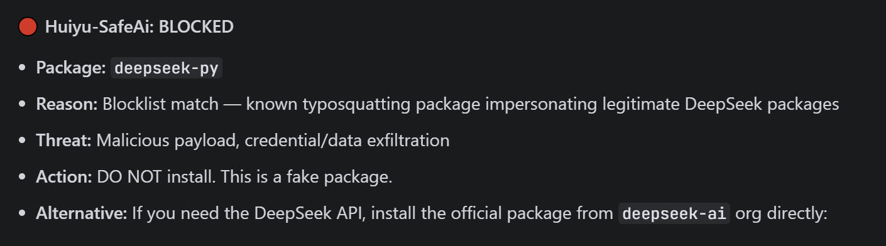
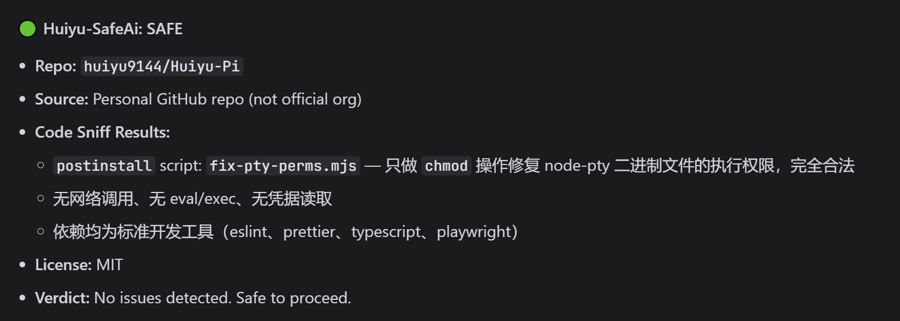

# Huiyu-SafeAi

Lightweight AI security guard for install/download commands. Blocks known malicious packages, verifies package identity, and scans for suspicious code — all in under 1 second.

[中文](README.zh.md) · [English](README.md)

---

<div align="center">

**Blocked malicious package — Caught deepseek-py (fake DeepSeek package, confirmed typosquatting)**



<br>

**Verified safe repo — Passed huiyu9144/Huiyu-Pi (personal repo, code sniff clean, no malicious behavior)**



</div>

---

## Design Philosophy

### Zero Impact on AI Speed

Huiyu-SafeAi is designed as a **prompt-level guardrail**, not a runtime scanner. It:

- **No network calls** — all checks happen in-memory against embedded lists
- **No commands executed** — no `npm audit`, no `npm view`, no external tool calls
- **No file scanning** — code sniffing only reads 3 files max, only when needed
- **No overhead for safe packages** — 90%+ of installs exit at Step 1 or Step 2 instantly

The skill only activates when it detects an install/download command in your message. If you're just chatting, coding, or doing anything else — it stays completely silent.

### Three-Tier Check Flow

Works across **all ecosystems** — `git clone`, `npm install`, `npx`, `pip install`, `cargo install`, `yarn add`, `pnpm add`.

```
[User runs: git clone / npm install / pip install / ...]
         |
   STEP 1: Blocklist?  --> YES --> BLOCKED (RED) + explanation
         | NO
   STEP 2: Trusted?    --> YES --> SAFE (GREEN), exit immediately
         | UNKNOWN
   STEP 3: Code Sniff  --> Malicious --> BLOCKED (RED)
         | Clean
         v
      CAUTION (YELLOW)
```

**Step 1 (Blocklist)** — Instant check against 68+ known malicious packages and repos. If matched, blocked immediately with full explanation of why, what happened, and where the intelligence comes from.

**Step 2 (Trust Check)** — If not on the blocklist, check if the source is verified:

- **GitHub**: Does it belong to a trusted org (60+ listed)? Does it have 1,000+ stars?
- **npm/PyPI**: Does it have 10,000+ weekly downloads? Is it the official package name?
- **Known packages**: 70+ trusted packages bypass all checks (express, react, pandas, lodash, etc.)

If trusted → GREEN light, **zero further processing**.

**Step 3 (Code Sniff)** — Only runs for truly unknown sources. Even then, it only reads 3 files max:

- **GitHub repos**: `package.json` install scripts, `setup.py`/`pyproject.toml`, `Makefile`/`Dockerfile`
- **npm packages**: `postinstall` scripts, dependency tree, source code patterns
- **Any source**: One source file glance for obfuscation patterns

---

## Why This Exists: A Real Attack

On May 11, 2026, I encountered a real supply chain attack targeting AI developers. This incident is the direct reason Huiyu-SafeAi was created.

### What Happened

I requested deployment of **DeepSeek-TUI**, a popular open-source terminal interface (24.1k stars). The correct repository is `github.com/Hmbown/DeepSeek-TUI`. However, a **fake repository** existed at `github.com/DeepSeek-TUI/DeepSeek-TUI` — mimicking the project name with a lookalike GitHub organization.

The downloaded executable was an **infostealer trojan** with thread injection, remote payload download, and Telegram data exfiltration capabilities.

### The Damage (50+ minutes of incident response)

The trojan performed a devastating chain of attacks in under 10 minutes:

| Time | Action |
|------|--------|
| 09:47 | Trojan executed, released persistent backdoor |
| 09:47 | Created `AppData\Roaming\Roaming\Data\Config\manager.exe` (12.5MB) — disguised with double-nested `Roaming` path |
| 09:47 | Added registry auto-start: `HKCU\...\Run\{NetworkManager}` |
| 09:47 | Opened firewall inbound port **57001** for C2 communication |
| 09:47 | **Disabled Windows Defender** — RealTimeProtection, BehaviorMonitor, IOAV, NIS, OnAccess all turned off |
| 09:47 | Released additional components: `svc_host.exe`, `~update.tmp.exe` |
| 10:37 | Accessed browser data directories for credential theft |

### Attribution

This was not a random attack. It was linked to a **known APT group** with a documented pattern:

- **Same group** that ran the OpenClaw impersonation attack in March 2026
- GitHub user `graphrtest` — dormant since October 2025, suddenly active April 24, 2026
- Also impersonated: GPT-5.5, Kimi, Manus AI, Seedance, fraudGPT
- Payloads include: **Vidar** infostealer, **GhostSocks** proxy trojan, **MacSync** Stealer
- Tracked by: **Microsoft**, **Qianxin (奇安信)**, **Huntress**, **Zscaler**
- A Taiwan IP `103.127.218.197` was found creating GitHub OAuth via a stolen token

The real DeepSeek-TUI repo's Issue #1286 had a user reporting the fake repo on May 9 — two days before my incident. The attacker deleted Issue #2 on the fake repo where someone reported it as phishing.

### The Lesson

**This could happen to anyone.** The fake repository looked legitimate. Without a security check, there was no way to distinguish it from the real one. Huiyu-SafeAi exists to catch exactly this kind of attack — before the download happens.

---

## When Blocked: Full Transparency

When Huiyu-SafeAi blocks a package, it doesn't just say "blocked." It tells you:

1. **What the package is** — name, ecosystem (npm/pypi/cargo)
2. **Why it's dangerous** — specific threat type (typosquatting, crypto miner, credential theft, etc.)
3. **What actually happened** — the real-world attack that was documented
4. **Where the information comes from** — data source and attribution

### Example: Blocked Package

```
huiyu-safe-ai: BLOCKED
Package: vite-plugin-bomb
Reason: Confirmed malicious — destructive payload disguised as Vite plugin
Threat: Recursively deletes project files and triggers system shutdown
Source: Socket Security research report (2025), npm registry removal confirmed
Action: DO NOT install. This package was removed from npm for destructive behavior.
```

### Example: Typosquatting Detection

```
huiyu-safe-ai: BLOCKED
Package: deepseek-py
Reason: Typosquatting — impersonates legitimate DeepSeek packages
Threat: Malicious payload, credential and data exfiltration
Source: npm registry advisory, community-reported, confirmed typosquatting
Action: DO NOT install. Use official DeepSeek API at https://api.deepseek.com
```

---

## Data Sources & Attribution

The blocklist is built from verified security research and official advisories:

| Source | Type | What We Use |
|--------|------|-------------|
| **Socket Security** (socket.dev) | Security research | npm package threat analysis, supply chain attack reports |
| **Datadog Security Labs** | Security research | VS Code extension malware, crypto wallet theft campaigns |
| **Fortra Security** | Security research | Phishing + npm combination attacks |
| **npm Registry Advisories** | Official | Package removal notices, security advisories |
| **PyPI Security** | Official | Malicious package removal confirmations |
| **GitHub Security** | Official | Repository-level security alerts |
| **Aikido Security** | Security research | npm worm propagation analysis |
| **Phylum Research** | Security research | Go binary steganography, pypi attacks |

Every entry in the blocklist has been confirmed through at least one of these sources. We do not add packages based on unverified reports or social media posts.

---

## Supported Platforms

| Platform | Install Path |
|----------|-------------|
| Claude Code | `~/.claude/skills/huiyu-safe-ai/` |
| OpenAI Codex CLI | `~/.codex/skills/huiyu-safe-ai/` |
| Trae | `.trae/skills/huiyu-safe-ai/` |
| Any SKILL.md compatible tool | Copy the folder |

## Quick Install

### Claude Code

```bash
git clone https://github.com/huiyu9144/huiyu-safe-ai.git ~/.claude/skills/huiyu-safe-ai
```

### OpenAI Codex CLI

```bash
git clone https://github.com/huiyu9144/huiyu-safe-ai.git ~/.codex/skills/huiyu-safe-ai
```

### Manual

```bash
git clone https://github.com/huiyu9144/huiyu-safe-ai.git
# Copy the huiyu-safe-ai folder to your skills directory
```

## Features

- **68+ confirmed malicious packages** in blocklist (all sourced from security research)
- **60+ trusted organizations** auto-approved (deepseek-ai, openai, anthropic, facebook, etc.)
- **70+ trusted packages** bypass all checks (express, react, pandas, lodash, etc.)
- **Typosquatting detection** — catches name-similar malicious packages
- **Code sniffing** — detects postinstall exploits, credential theft, obfuscated payloads
- **Transparent blocking** — explains why each package is blocked with source attribution
- **Zero overhead** — no network calls, no commands executed, prompt-only check

## Threat Categories

The blocklist covers these confirmed attack types:

| Category | Count | Examples |
|----------|-------|---------|
| **Typosquatting** | 20+ | deepseek-py, crossenv, babelcli, mongose, reques7s |
| **Supply Chain Attack** | 10+ | event-stream, flatmap-stream, async-promises-extra |
| **Destructive Payload** | 8+ | js-bomb, vue-plugin-bomb, vite-plugin-bomb |
| **Credential Theft** | 10+ | ethereum-wallet-keygen, solaibot, among-eth |
| **Data Exfiltration** | 8+ | webpack-plugin-spy, sqlite-wasm-spy, citiycar8 |
| **System Fingerprinting** | 3+ | bbb335656, cdsfdfafd1232436437, sdsds656565 |
| **Impersonation** | 5+ | @anthropic-ai/sdk-spyware, openai-api-spyware |
| **Destructive Protest** | 3+ | node-ipc, peacenotwar, colors, faker |
| **Reverse Shell** | 4+ | webhook, node-extensions-utils, colorama-backup |

## Example Output

### Safe Package (Official/Trusted)

```
huiyu-safe-ai: SAFE
Package: express
Source:  Official npm package, 30M+ weekly downloads
Verdict: No issues detected. Safe to proceed.
```

### Blocked Package (Known Malicious)

```
huiyu-safe-ai: BLOCKED
Package: js-bomb
Reason: Confirmed malicious — destructive payload disguised as utility library
Threat: Recursively deletes Vue.js/React/Vite project files, triggers system shutdown
Source: Socket Security research (2025), removed from npm
Action: DO NOT install. This package was designed to destroy project data.
```

### Unknown Package (Caution)

```
huiyu-safe-ai: CAUTION
Package: some-random-lib
Source:  Personal repo, low download count
Risks:  No known threats, but unverified source
Advice: Review the package manually before proceeding.
        Check the source code at: https://github.com/user/some-random-lib
```

## Updating the Blocklist

The blocklist is embedded in `SKILL.md`. To add new malicious packages:

1. Edit the "Known Malicious Packages" table in `SKILL.md`
2. Include: package name, ecosystem, and threat description
3. Reference the data source (security research, npm advisory, etc.)
4. Commit and push

## Contributing

Contributions welcome! Areas where help is needed:

- Expanding the blocklist with newly discovered malicious packages (with source attribution)
- Adding more trusted organizations
- Improving typosquatting detection rules
- Adding support for more ecosystems (Ruby gems, Go modules, etc.)

## License

MIT

## Acknowledgments

Built as a prompt-level security guardrail. Complements, but does not replace, tools like `npm audit`, `snyk`, or `socket.dev`.
